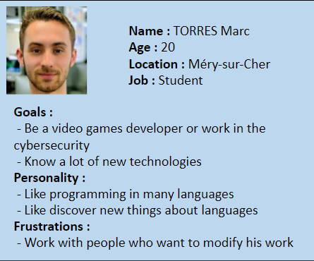

Table of contents

- [Overview](#overview)
  - [Project Scope](#project-scope)
  - [Ressources](#ressources)
    - [Technologies Used](#technologies-used)
  - [Targets Audience](#targets-audience)
  - [Risks and assumptions](#risks-and-assumptions)
  - [Requirements](#requirements)
  - [UseCases](#use-cases)
  - [Definitions](#definitions)

 

# Overview
<!-- 
## Teams Members

|Members|Roles |
|:---:|:---:|
|[Arthur Lemoine](https://github.com/arthur-lemo1ne)| Tech Leader|
|[Théo Diancourt](https://github.com/TheoDct)| Project Manager|
|[Martin Lorut Gauriat](https://github.com/MartinLorutGauriat)| Team Member|
|[Karine Vinette](https://github.com/KarineVinette)| Team Member|
|[Nicolas Mida](https://github.com/Nicolas-Mida)| Team Member|
|[Alexandre Bobis](https://github.com/AlexandreBobis)| Team Member| -->

## Project Scope

<!-- - Goals: Programming a VR simulation of a visit day at [ALGOSUP](https://www.algosup.com/) inside the B3[^1] 
- Deliverables: Functionnal and technical specifications, simulation of a visit at ALGOSUP inside the B3[^1] 
- Features: 
    - Move into the B3
    - Make interaction with environnement
    - Security System
    - NPC 
    - Indication to visit (GPS)
    - Have multiples characters 
- Tasks: convert .bmix into something usable by Unity, make some 3D objects to make the experience better, make the features into the software, 
- Deadline: 7 April 2022 -->

For this project we need to create a VR[^3] simulation of a regular day at Algosup in the next school building called the B3[^1] with features depending on your characters and his roles in the school.

We need to make some modification to the existing renovation plan in order to repair some mistakes made by the architect.

<!-- WIP -->

## Ressources

For this project, the architect give us a 3d file in .ifc[^4] of the building and a 2d plan in .pdf[^5]

To try the simulation all along the project we have been provided with the virtual reality headsets : Oculus Quest 2[^6]

### Technologies Used

We will use these softwares to achieve the project :

Unity[^7] :

- Pro Builder[^8]
- Netcode[^9]
- Relay[^10]
- Lobby[^11]
- Vivox[^12]

Visual Studio[^13]

Git[^14]

CAD Exchanger[^15]

## Targets Audience

Our targets audience is all the people who have an interest in ALGOSUP and want to discover the school by visiting its new layout so it include future and actual students in order to have their opinion about what they think of the new design, potential investor could be interested to have a more precise idea of the typical day.

## Risks and assumptions

Don't be usable with all VR[^3] headset.

Bad performance while using the headset.

Don't got the time to create a stable multiplayer version.

<!-- WIP -->

## Requirements

- Should have a good feeling while moving in the building.
- Interract with as many objects as possible.
- Convert the B3[^1] 3D file into something usable with Unity[^7].
- Get the most realistic possible simulation.
- Time management.
- Security System :
  - Camera
  - Door locked with card
  - SoftWare
- Alarm
  - Fire
    - Little red Boxes
    - Extinguisher
    - Smoke detector
- Have differents scenarios depending on the role chosen :
  - Don't do the same tasks all along the day
  - Don't have access to the same place
  - Have differents schedule
- Upgrade the actual state of the provided plan to provide a better experience;
  - Better room repartition
  - Change the utility of some room
  - Reform the design
- A map so users know where they are all the time.
- NPC[^2] to replace actual students
<!-- WIP -->

## Use Cases

The reason of this project is to have a preview of the building finished, while we upgrade some points to improve the overall experience.

With this, Algosup should be able to have a whole new level to show the school, and people interested in one way or another in Algosup could have a real school day experience.

This will be useful because we can imagine a presentation to some investors, future students or even just people interested in Algosup able to visit the school all in remote with only a VR[^3] Headset.

 

We think about multiple cases :

- 
- Student with Disability : Bruno
- 
- Janitors : Marie
- 

<!-- Add a Personae About Franck, with all the access into the school  -->

<!-- ## Configuration 

Have a headset compatible, download the application  -->

<!-- ## Non functionnal requirements 

NPC,  -->

<!-- ## Error reporting -->

## Definitions

[^1]: The B3 is an old building in the center of Vierzon, which is also the next location for the connected campus who are going to be composed by Algosup, the CNAM and an incubator for start-up.

[^2]: NPC stand for Non Playable Character, will be an A.I implemented in the application.

[^3]: VR is the definition of virtual reality comes, naturally, from the definitions for both ‘virtual’ and ‘reality’. The definition of ‘virtual’ is near and reality is what we experience as human beings. So the term ‘virtual reality’ basically means ‘near-reality’. This could, of course, mean anything but it usually refers to a specific type of reality emulation.

[^4]: An ifc file is a CAD data exchange file format intended for description of architectural, building and construction industry date.

[^5]: An pdf file is a file format developed to present documents, including text formatting and images.

[^6]: Oculus Quest 2 is a Virtual reality headset who can run a program without any cords or a PC.

[^7]: Unity is a game engine designed to create games for a wide range of devices.

[^8]: Pro Builder is a native 3D model editor of unity.

[^9]: Netcode is a native tool from unity used to build multiplayer foundation system by allows the user to connet to a host by its IP and port.

[^10]: Relay is a native tool from unity used to build the connexion link from an users to another.

[^11]: Lobby is a native tool from unity used to create an entry point from a users to another.

[^12]: Vivox is a native tool from unity used to let all users from a same lobby to talk to each other.

[^13]: Visual Studio is a source-code editor made by microsoft used to write code.

[^14]: Git is a software used to centralize our work throughout the project.

[^15]: CAD exchanger is a software used to convert an .ifc file to an .fbx file in order to use it with unity.
