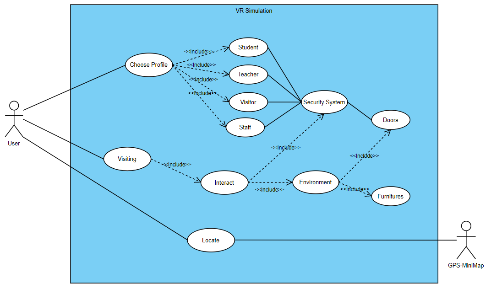

# Functionnal Specification 

## Project Scope

- Goals: Programming a VR simulation of a visit day at [ALGOSUP](https://www.algosup.com/) inside the B3[^1] 
- Deliverables: Functionnal and technical specifications, simulation of a visit at ALGOSUP inside the B3[^1] 
- Features: 
    - Move into the B3
    - Make interaction with environnement
    - Security System
    - NPC 
    - Indication to visit (GPS)
    - Have multiples characters 
- Tasks: convert .bmix into something usable by Unity, make some 3D objects to make the experience better, make the features into the software, 
- Deadline: 7 April 2022
<!-- WIP -->
## Targets Audience 

Our targets audience is all the people who have an interest in ALGOSUP and want to discover the school by visiting its new layout.

## Risks and assumptions

Don't be usable with all VR headset
<!-- WIP -->

## Requirements

Move into the B3, Make interaction with environnement, Security System, 
<!-- WIP -->

## UseCases

## Configuration 

Have a headset compatible, download the application 

<!-- ## Non functionnal requirements 

NPC,  -->

<!-- ## Error reporting -->

## Definitions 

 B3 : The B3 is the next location for the school ALGOSUP at the center of Vierzon

 NPC : NPC stand for Non Playable Character, will be an A.I implemented in the application,

 VR : The definition of virtual reality comes, naturally, from the definitions for both ‘virtual’ and ‘reality’. The definition of ‘virtual’ is near and reality is what we experience as human beings. So the term ‘virtual reality’ basically means ‘near-reality’. This could, of course, mean anything but it usually refers to a specific type of reality emulation.
