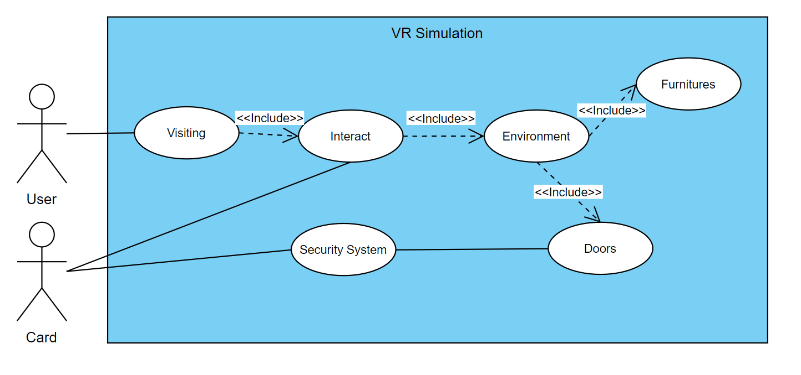
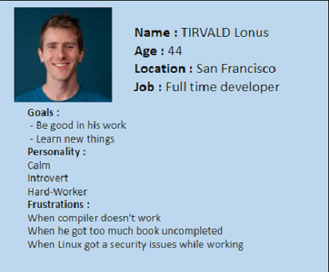

Table of contents

- [Overview](#overview)
  - [Stakeholders](#stakeholders)
  - [Approvals](#approvals)
  - [Targets Audience](#targets-audience)
  - [Project Scope](#project-scope)
  - [Risks and assumptions](#risks-and-assumptions)
  - [Use Cases](#use-cases)
  - [Personae](#personae)
  - [Requirements Specs](#requirements-specs)
  - [Solution overview](#solution-overview)
  - [Ressources](#ressources)
    - [Technologies Used](#technologies-used)
  - [Definitions](#definitions)

 

## Stakeholders

- JEANNIN Franck
- GOISBEAULT Sébastien

## Approvals

- You need to come up with realistic and testable scenarios about access control, room usage, circulation, signage, furniture, storage, plugs, toilets, etc.

- The virtual setup needs to be as close as possible to the real setup. 
- For instance, if a door has a lock in the real world, it would also require some sort of badge/key in the virtual world, a room that can only fit 10 people in the real world, will have the equivalent capacity in the virtual world, etc.  

- You need to obey the laws of physics in the virtual world, no super powers, you can’t walk across walls, fly, etc.
You are required to use virtual reality headsets (Oculus Quest 2) with Unity framework programmed in C# to simulate the entire building.

- Imagine profiles of users (personae) and the way they interact with the school during the day
- You need to figure out how to convert the bimx file into something usable with Unity

## Targets Audience

Our targets audience is composed of all the people who have an interest in ALGOSUP and want to discover the school by visiting its new layout. It include future and actual students in order to have their opinion about what they think of the new design, potential investor could also be interested to have a more precise idea of the typical day in the school.

## Project Scope

For this project we need to create a VR[^3] simulation of a regular day at Algosup in the next school building called the B3[^1] with features depending on your character and his role in the school.

We need to make some modification to the existing renovation plan in order to repair some mistakes made by the architect.

With this, Algosup should be able to be on a whole new level to show the school, and people interested in one way or another in Algosup could have a real school day experience.

This will be useful because we can imagine a presentation to some investors, future students or even just people interested in Algosup will be able to visit the school all in remote with only a VR[^3] Headset.

<!-- WIP -->

## Risks and assumptions

- The simulation may no be compatible with all VR[^3] headset.

- We could have bad performances while using the headset.

- We may don't have enough time to create a stable multi-user version.

<!-- WIP -->

## Use Cases

<!-- WIP -->

 

## Personae

We thought about multiple cases :

First Student (with disability)

Second Student

Third Student

Stakeholder

Janitor

Staff

<!-- Add a Personae About Franck, with all the access into the school  -->

## Requirements

- Should have a good feeling while moving in the building.
- Interract with as many objects as possible.
- Convert the B3[^1] 3D file into something usable with Unity[^7].
- Get the most realistic possible simulation.
- Security System :
  - Door unlockable with cards
- Have differents scenarios depending on the role chosen :
  - Don't do the same tasks all along the day
  - Don't have access to the same place
  - Have differents schedule
- Upgrade the actual state of the provided plan to provide a better experience;
  - Change the utility of some rooms
  - Create a interior design
- NPC[^2] to replace actual students

## Configuration 

You will need to have a compatible headset, then download the application on the device and you are good to go.

## Non Functionnal Requirements 

 - Multi-user
 - Time management
 - Security System
    - Software
    - Cameras
 - Fire alarm / security
    - Little red boxes
    - Extinguishers
    - Smoke detectors
- A map so users know where they are all the time.

## Solution Overview

### Students

### Staff

### Janitor

## Definitions

[^1]: The B3 is an old building in the center of Vierzon, which is also the next location for the connected campus who are going to be composed by Algosup, the CNAM and an incubator for start-up.

[^2]: NPC stand for Non Playable Character, will be an A.I implemented in the application.

[^3]: VR is the definition of virtual reality comes, naturally, from the definitions for both ‘virtual’ and ‘reality’. The definition of ‘virtual’ is near and reality is what we experience as human beings. So the term ‘virtual reality’ basically means ‘near-reality’. This could, of course, mean anything but it usually refers to a specific type of reality emulation.

[^4]: An ifc file is a CAD data exchange file format intended for description of architectural, building and construction industry date.

[^5]: An pdf file is a file format developed to present documents, including text formatting and images.

[^6]: Oculus Quest 2 is a Virtual reality headset who can run a program without any cords or a PC.

[^7]: Unity is a game engine designed to create games for a wide range of devices.

[^8]: Pro Builder is a native 3D model editor of unity.

[^9]: Netcode is a native tool from unity used to build multiplayer foundation system by allows the user to connet to a host by its IP and port.

[^10]: Relay is a native tool from unity used to build the connexion link from an users to another.

[^11]: Lobby is a native tool from unity used to create an entry point from a users to another.

[^12]: Vivox is a native tool from unity used to let all users from a same lobby to talk to each other.

[^13]: Visual Studio is a source-code editor made by microsoft used to write code.

[^14]: Git is a software used to centralize our work throughout the project.

[^15]: CAD exchanger is a software used to convert an .ifc file to an .fbx file in order to use it with unity.
