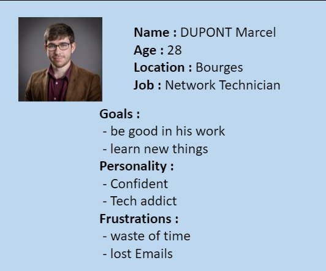
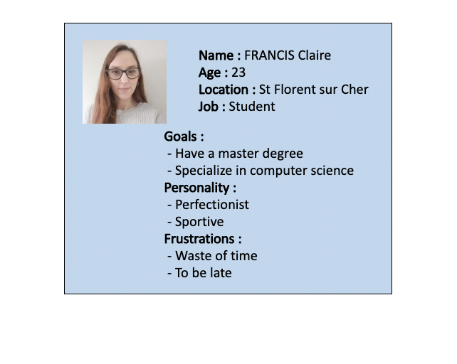
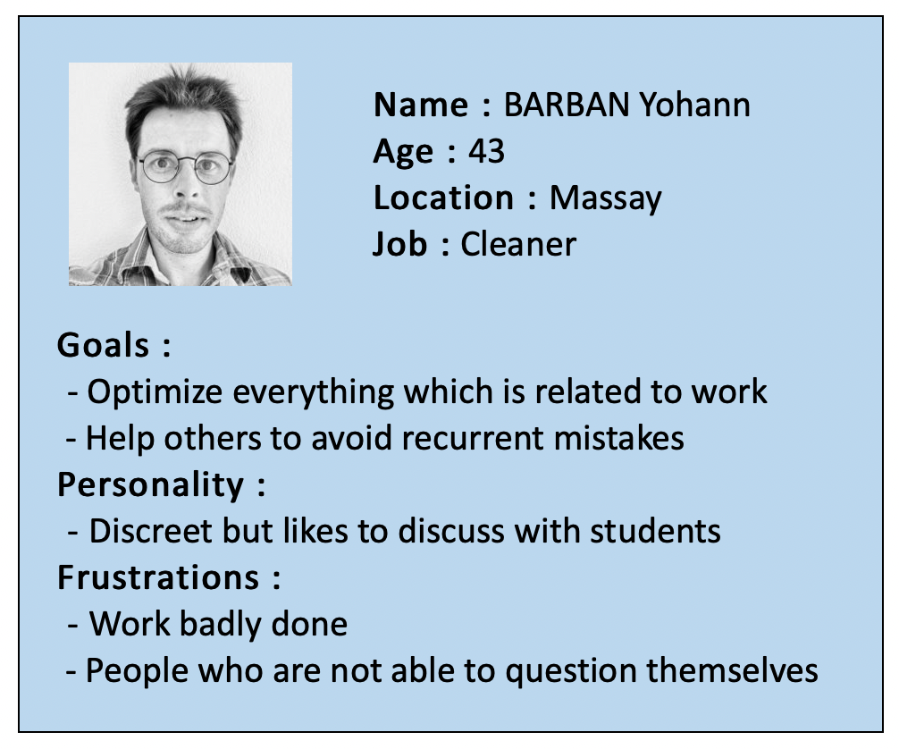

 ## Marc Dupond(student1) : 

  Basics Informations :  
  -<strong>Profile :</strong>  
  -<strong>Age :</strong>   
  -<strong>Occupation :</strong>  
  -<strong>Location :</strong>  

He comes to school by car,he arrives at the entry of the school late by 5 minutes. 
The door is closed, he has to ring and be registered late by the manager. 
He can wait in a room dedicated as the next break at 10h45. 
At 10h50, he goes to his English course in a room with 20 others students and one teacher. 
At 12h30, he is going in the city center to buy lunch and goes to the restaurant to eat. He is with 3 students. 
At 13h20, he is going to the men's toilets. 
At 13h30, he is going to project with his team of 5 others students. 
At 15h15, he is going with his team to buy a coffee at the coffee machine. 
At 15h30, he returns to his project room. 
At 17h, he leaves the school. 

## Claire (student2) : 

Basics Informations :  
  -<strong>Profile :</strong>  
  -<strong>Age :</strong>   
  -<strong>Occupation :</strong>  
  -<strong>Location :</strong>  
She comes to school by car, she arrives at the entry of the scool at 08h50.  
She bips the locker at the main door.  
She is going to her computer class with 20 others student and a teacher.  
At 10h45, she is going out to smoke and returns to her class.  
At 12h30, she is going to the restaurant and heat her meal and eats. 
At 13h15, she is going out to smoke.  
At 13h30, she returns to the same room to her computer class.  
At 15h15, she is going out to smoke, and she goes waiting for a friend in one other room. They go out together. 
At 15h30, she returns to her class.  
At 16h, she quits the class to go to the lady's toilet.
At 17h, she quits the school with a friend.  

## Julia (Staff1) : 

Basics Informations :  
  -<strong>Profile :</strong>  
  -<strong>Age :</strong>   
  -<strong>Occupation :</strong>  
  -<strong>Location :</strong>  

She comes to school by bike,she arrives at the entry of the school at 08h25.  
She goes to the administration room.  
At 12h, she goes to the staff's restaurant and heat her meal. 
At 13h, she returns to the administration room. 
At 15h, she goes to the staff's restaurant to take a coffee. 
At 17h30, she quits the school and takes her bike.

## Marie (cleaning1) : 

Basics Informations :  
  -<strong>Profile :</strong>  
  -<strong>Age :</strong>   
  -<strong>Occupation :</strong>  
  -<strong>Location :</strong>  

She comes to school by car,she arrives at the entry of the school at 17h.  
She goes to the cleaning room to take her staff and go cleaning.  
She is with 2 others people.  
She returns to the cleaning room and quits the scholl at 18h30.  

## Patrick (skateholders1) : 

Basics Informations :  
  -<strong>Profile :</strong>  
  -<strong>Age :</strong>   
  -<strong>Occupation :</strong>  
  -<strong>Location :</strong>  
  
He comes to school by car,he arrives at the entry of the school at 08h45.  
He goes to the teacher's room.  
At 08h55, he goes to his classroom.  
At 10h45, he goes to the staff's restaurant to take a coffee. 
At 10h55, he goes to the teacher's toilet. 
At 11h, he returns to his classroom. 
At 12h30, he goes out to eat. 
At 13h15, he goes to the staff's restaurant to take a coffee. 
At 13h35, he returns to his classroom. 
From 17h to 17h15, he speaks with students. 
At 17h15, he goes to the teacher's room and speaks to the director. 
At 17h40, he leaves the school.

## Bruno (studentWithDisability1) : 

Basics Informations :  
  -<strong>Profile :</strong>  
  -<strong>Age :</strong>   
  -<strong>Occupation :</strong>  
  -<strong>Location :</strong>  

He comes by car, he arrives at the entry of the school with a  whellchair.  
At 9h, he goes to the amphi for a computer science class.  
At 10h45, he goes to the man's toilet. 
At 12h30, he goes to the restaurant to eat his meal. 
At 13h25, he goes to a project room to work with his team. 
At 15h15, he goes to take a coffee. 
At 15h25, he returns to his project room. 
At 17h, he leaves the school.

## Questions: 
1. Where do we put our meal for the lunch the morning, is there enough cooler? Can someone steals the meal (we are 150 students)? 
2. Do we have enough toilets for men? (it needs two toilets for 20 people)
3. We need private toilets for the staff of the school.
4. We need distributers : food, coffee and beverage.

